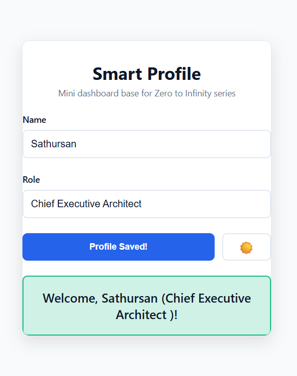
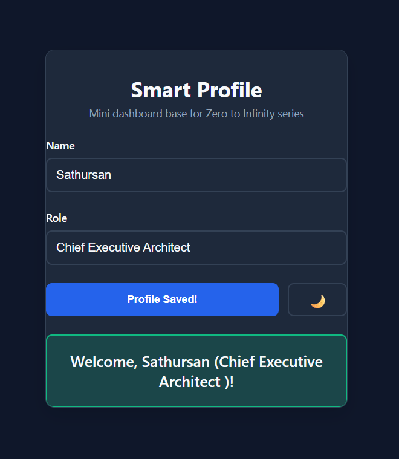

# Day 1: Smart Profile UI System

Modern frontend foundation. From static pages to interactive UI systems that respond to user behavior in real-time 

## ✨ Features
- 🔄 Real-time input → output updates (pure DOM manipulation)
- 🌙 Light/Dark theme toggle (CSS variables + smooth transitions)
- 💾 SessionStorage persistence (survives refresh/tabs)
- 📱 Fully responsive (mobile-first card layout)
- ⚡ Loading states, form validation, error handling
- ♿ Accessible (ARIA labels, keyboard navigation)

## 🛠 Tech Stack

HTML5 | CSS3 (Variables, Flexbox, Animations) | Vanilla JavaScript

## 🚀 Quick Start
1. Clone: `git clone [https://github.com/ksathu07/zero-to-infinity-fullstack-series.git]`
2. Open `index.html` in Chrome

## 📸 Demo
**Light Mode** | **Dark Mode**
---|---
 | 

## 🧪 Testing Checklist
- [x] Name/Role input → live preview
- [x] Save → loading → success feedback
- [x] Theme toggle → smooth transition
- [x] Refresh → state persists
- [x] Mobile responsive (<768px)

## 🎯 Next Up
Day 2: Backend API integration + persistent storage

## 📄 License
MIT - Use for learning/portfolio/production.

---
*Built during SarlaYash Zero to Infinity Full-Stack Series*